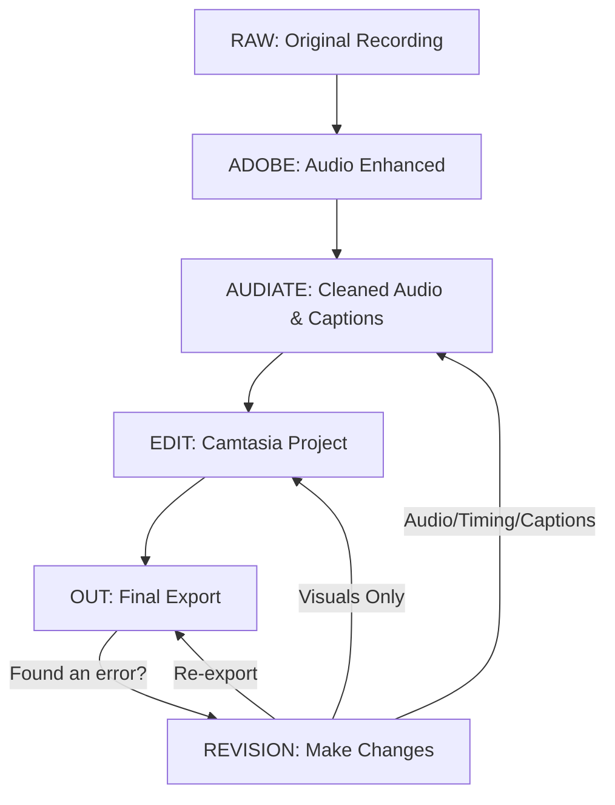

# Folder Architecture

This guide explains the simple, reliable folder structure used for Camtasia-based course production. It’s designed to be easy to follow—no advanced degree required!

---

## Why Use a Standard Folder Structure?

- Keeps all your files organized and easy to find
- Prevents mistakes and lost work
- Makes automation and teamwork much easier
- The architecture is used by course production architects and is battle-tested in real projects

---

## The 5-Folder Pipeline

Every project uses the same five main folders, one for each stage of production:

```
RAW/
ADOBE/
AUDIATE/
EDIT/
OUT/
```

### What Goes in Each Folder?

- **RAW/** — Original screen recordings and audio, straight from your capture tool
- **ADOBE/** — Audio files after enhancement (e.g., noise reduction, clarity boost)
- **AUDIATE/** — Cleaned-up audio and captions from Audiate
- **EDIT/** — Camtasia project files and assembled timelines
- **OUT/** — Final exported videos, ready for delivery or upload

---

## Folder Flow Diagram (Including Revisions)

Below is a diagram showing how files move through each folder in the production pipeline, including what happens when you need to make changes or revisions in the future:



- Start with your raw recording in RAW/
- Enhance audio and save to ADOBE/
- Clean up audio and captions in AUDIATE/
- Assemble and edit in Camtasia (EDIT/)
- Export the final video to OUT/
- If you find an error after export, follow the revision path:
  - For audio, timing, or captions: go back to AUDIATE
  - For visuals only: go back to EDIT
  - After making changes, re-export to OUT/

This flow keeps your project organized, deterministic, and easy to update or fix in the future.

---

## Example Project Structure

```
project-root/
├── RAW/
│   └── c01_p007_1a_greetings_d.mp4
├── ADOBE/
│   └── c01_p007_1a_greetings_d_audio_enhanced.wav
├── AUDIATE/
│   ├── c01_p007_1a_greetings_d_audiate.wav
│   └── c01_p007_1a_greetings_d.srt
├── EDIT/
│   └── c01_p007_1a_greetings_d.tscproj
└── OUT/
    └── c01_p007_1a_greetings_d.mp4
```

---

## Versioning Files: Where and Why?

- **OUT/** (Final Exports):
  - Versioning is recommended for final deliverables (e.g., `lesson_01_v2.mp4`) when you need to track revisions, send updates for review, or maintain a release history.
- **EDIT/** (Camtasia Projects):
  - Versioning project files (e.g., `lesson_01_v2.tscproj`) is helpful for preserving major editing milestones or recovering from mistakes.
- **RAW/**, **ADOBE/**, **AUDIATE/**:
  - These folders should generally contain only the latest, authoritative file for each lesson—no versions. Versioning source or intermediate assets can create confusion and clutter.

> Keep versioning simple and only where it adds value. Document any exceptions in your project README.

---

## Tips for Success

- Never mix files between folders—each file has one home.
- Only keep the latest, authoritative version in each folder.
- If you revise a file, update its version number (e.g., `_v2`).
- Document any custom folders or exceptions in your project README.

---

## TechSmith Note

- TechSmith (the makers of Camtasia and Audiate) does not provide or enforce a standard folder structure, so it’s up to you to organize your projects for reliability and efficiency. This guide gives you a proven system that works regardless of official support.

---

## Special Scenario: Merging Recordings After a Reboot

Sometimes, you need to record a process (like software installation) that requires a system reboot. In these cases, you must:

1. Stop the screen recording before the reboot (e.g., `RAW/install_part1.mp4`).
2. Start a new recording after the reboot (e.g., `RAW/install_part2.mp4`).

### How to Handle Multiple Recordings

- **Option 1: Merge into a Single Lesson**
  - Import both recordings into Camtasia (EDIT/).
  - Place them sequentially on the timeline.
  - Add a brief transition or title card to indicate the reboot.
  - Export as a single video (e.g., `OUT/install_complete.mp4`).
  - This is recommended if the process is best understood as one continuous lesson.

- **Option 2: Keep as Separate Lessons**
  - Treat each recording as its own lesson (e.g., `install_part1`, `install_part2`).
  - Export each as a separate video.
  - This is useful if each part stands alone or is referenced separately in your course.

### Other Multi-Clip Scenarios

- **Adding a Standard Intro or Outro:**
  - Keep your intro/outro clips as separate files (e.g., `RAW/intro.mp4`, `RAW/outro.mp4`).
  - Import them into Camtasia and place them at the start/end of your timeline as needed.

- **Inserting Missed or Supplemental Clips:**
  - If you forgot to record a section, record the missing part as a new clip (e.g., `RAW/install_part3.mp4`).
  - Insert it at the correct spot on the Camtasia timeline.
  - Use transitions or title cards to make the edit seamless for viewers.

### Best Practice
- Choose the approach that makes the most sense for your learners and course structure.
- If merging, document the source files and the merge decision in your project README for traceability.

---

> **See Also:**
> - For a deeper, logic-driven view of the entire workflow (including decision points and allowed operations), see the [Camtasia Production Flow State Machine](../workflows/CamtasiaProductionFlow-StateMachine.md).

---

**Important:**
- If the missed or supplemental clip affects the main lesson content, narration, or audio timing, insert it in Audiate—not Camtasia. Audiate is the timing and transcript authority. This keeps captions, transcript, and audio perfectly in sync and preserves a deterministic workflow.
- Use Camtasia only for assembling, adding intros/outros, and non-destructive visual edits. Inserting content clips in Camtasia can break sync between audio, captions, and transcript.

---

**Warning:**
- Before sending audio to Audiate for the first time, you can use Camtasia freely to trim, assemble, or adjust your raw recordings. Once you’ve created your authoritative Audiate file, all timing and content edits must be done in Audiate to maintain sync and determinism.

---

_Last updated: April 2, 2026_
