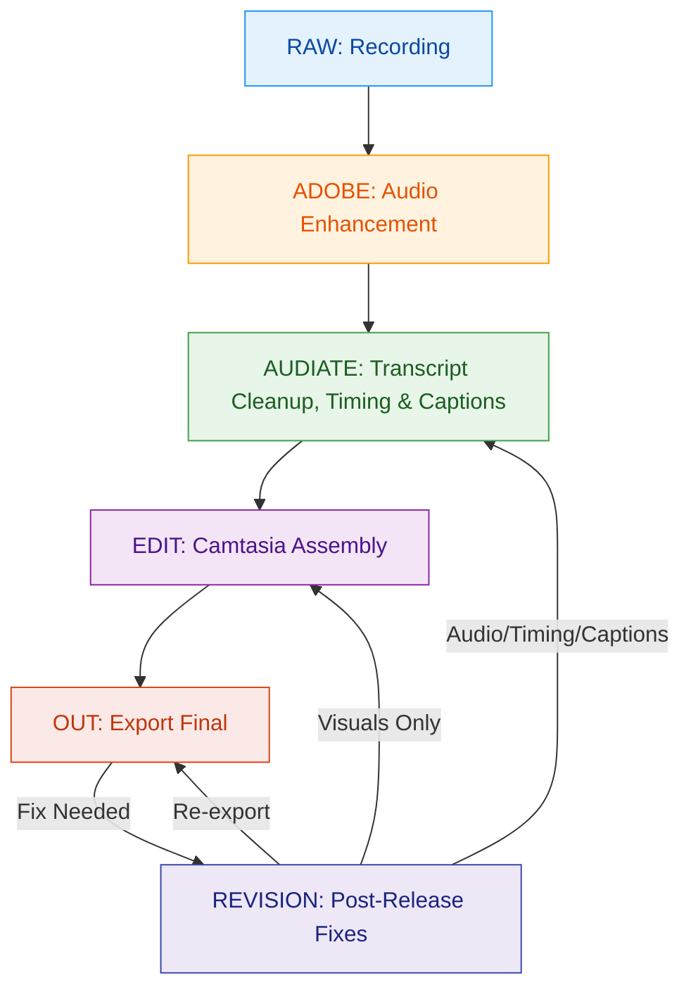

# Camtasia Production Flow State Machine (Deluxe Edition)

This document provides an in-depth, visually enhanced, and rationale-rich specification for the Camtasia course production state machine. It includes:

1. A detailed state machine diagram (Mermaid)
2. State-by-state rationale and best practices
3. Transition table for all allowed moves
4. Error handling and recovery logic
5. References to workflow files and CAOL
6. Revision workflow integration

---

## 1. State Machine Diagram

---

## 2. State-by-State Rationale & Best Practices

### RAW (Recording)
- **Purpose:** Capture original lesson content with maximum fidelity.
- **Best Practices:**
  1. Use consistent recording settings (resolution, framerate, mic gain).
  2. Record in a quiet environment.
  3. Save immediately to the RAW folder.
- **Risks if Skipped:** Downstream edits become unreliable; timing drift.

### ADOBE (Audio Enhancement)
- **Purpose:** Standardize and enhance audio quality before transcript editing.
- **Best Practices:**
  1. Use the same enhancement preset for all lessons.
  2. Export as WAV only.
  3. Do not alter timing or content.
- **Risks if Skipped:** Inconsistent audio quality; harder transcript cleanup.

### AUDIATE (Transcript Cleanup & Timing)
- **Purpose:** Remove filler, tighten pacing, produce timing-accurate audio, and finalize captions.
- **Best Practices:**
  1. Edit only transcript-based content.
  2. Avoid manual timing changes.
  3. Export with lesson-consistent naming.
  4. Edit, review, and finalize captions (SRT) in Audiate.
- **Risks if Skipped:** Timing errors; non-deterministic edits; inaccurate captions.

### EDIT (Camtasia Assembly)
- **Purpose:** Assemble visuals, apply overlays, and export final lesson.
- **Best Practices:**
  1. Follow CAOL strictly (see below).
  2. Lock audio track after alignment.
  3. Add only non-destructive visual effects.
- **Risks if Skipped:** Timing drift; broken links; non-reproducible exports.

### OUT (Export Final)
- **Purpose:** Produce the authoritative deliverable for distribution.
- **Best Practices:**
  1. Export to OUT/ with deterministic naming.
  2. Run quality checks before delivery.
- **Risks if Skipped:** Delivery of incorrect or incomplete lessons.

### REVISION (Post-Release Fixes)
- **Purpose:** Enable traceable, controlled corrections after release.
- **Best Practices:**
  1. Restore authoritative project and media.
  2. Follow original workflow for each tool.
  3. Log all revisions and reasons.
- **Risks if Skipped:** Untracked changes; loss of reproducibility.

---

## 3. Transition Table

| From      | To         | Condition/Trigger                | Allowed? |
|-----------|------------|----------------------------------|----------|
| RAW       | ADOBE      | Recording complete               | Yes      |
| ADOBE     | AUDIATE    | Audio enhancement complete       | Yes      |
| AUDIATE   | EDIT       | Transcript cleanup complete      | Yes      |
| EDIT      | OUT        | Visual assembly complete         | Yes      |
| OUT       | REVISION   | Error found post-export          | Yes      |
| REVISION  | AUDIATE    | Audio/timing fix needed          | Yes      |
| REVISION  | EDIT       | Visual-only fix needed           | Yes      |
| REVISION  | OUT        | Re-export after fix              | Yes      |
| Any       | Previous   | Manual backtracking (forbidden)  | No       |

---

## 4. Error Handling & Recovery

- If a file is missing/corrupted, return to the previous state and regenerate the artifact.
- If a typo or error is found after export, follow the Revision Workflow.
- Never edit RAW or ADOBE artifacts directly during revision.
- All fixes must be logged for traceability.

---

## 5. CAOL Reference (EDIT Stage)

- Only allowed operations: Import, align, lock, add non-destructive visuals, export.
- Forbidden: Timing edits, ripple deletes, audio exports, media renaming.
- See: CamtasiaProductionFlow-Full.md for full CAOL list.

---

## 6. Revision Workflow Integration

1. Restore authoritative EDIT/<lesson>.tscproj and media.
2. Open in Camtasia; if transcript/audio edits are needed, open AUDIATE/<lesson>.wav in Audiate.
3. Make only allowed edits per original workflow.
4. Export corrected lesson to OUT/.
5. Optionally increment version number (e.g., lesson_##_v2.mp4).
6. Log revision and reason.

---

## References
- CamtasiaProductionFlow-Minimal.md
- CamtasiaProductionFlow-Hybrid.md
- CamtasiaProductionFlow-Full.md

---

_Last updated: April 2, 2026_
